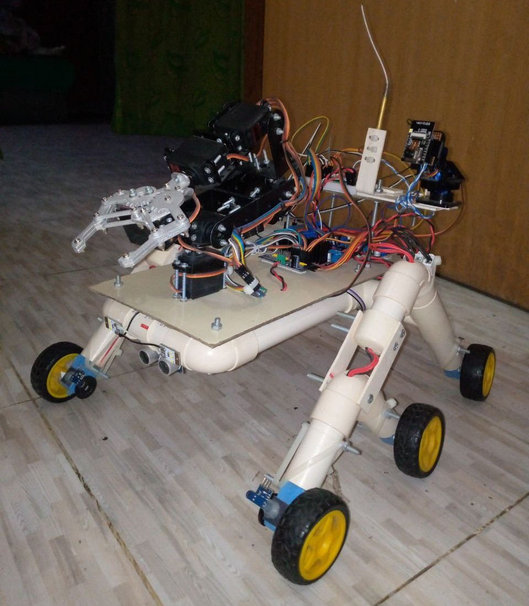
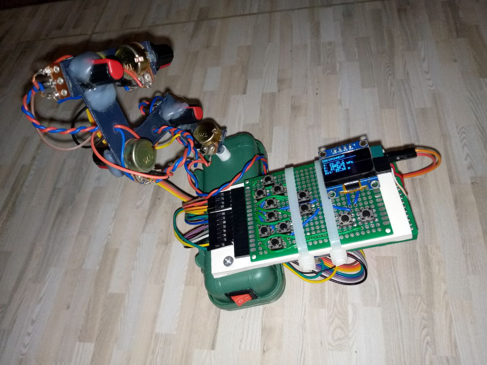

# Remote Controlled Rover with Manipulator Arm

A fully remote-controlled rover featuring an articulated robotic arm, real-time sensor telemetry, and intuitive physical control interface.

## Features

**Rover Specifications:**
- 6-wheel drive system for enhanced mobility
- 6 degrees-of-freedom manipulator arm
- ESP32-CAM with pan/tilt functionality
- Onboard lighting system
- Powered by ESP32-S3

**Sensor Suite:**
- GPS positioning
- IMU (Inertial Measurement Unit)
- Digital compass
- Environmental sensors (temperature, humidity, barometer)
- Ultrasonic distance sensors

**Remote Control:**
- Custom handheld controller with real-time display
- Physical miniature arm replica for intuitive manipulation control
- Live sensor data visualization
- Powered by ESP32-C6 and Arduino Nano
- Wireless communication via ESP-NOW protocol

## Technology Stack

- **Rover MCU:** ESP32-S3
- **Remote MCU:** ESP32-C6 + Arduino Nano
- **Communication:** ESP-NOW protocol
- **Camera:** ESP32-CAM module

## How It Works

The rover receives control commands wirelessly from the handheld remote using the ESP-NOW protocol. The remote features a miniature replica arm that mirrors the movements of the rover's full-size manipulator, providing intuitive control. All sensor data is transmitted back to the remote and displayed in real-time on the integrated screen.
